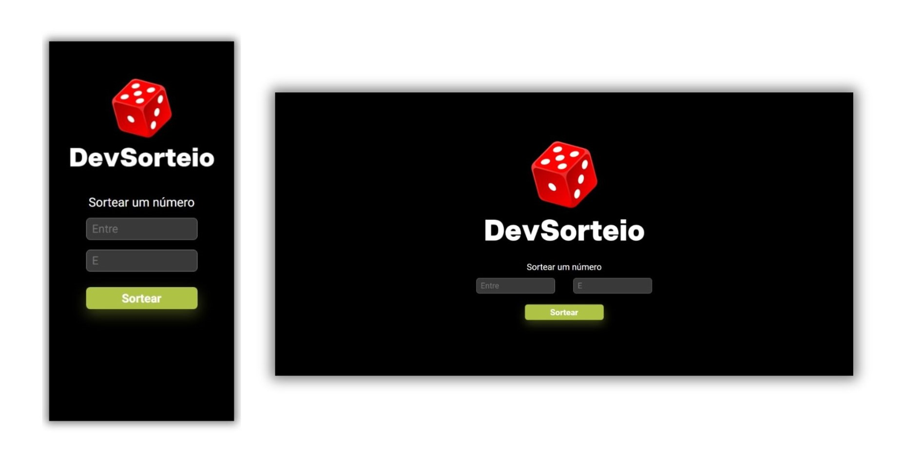

## DevSorteio

Project completed as a challenge in the DevClub

## What is it?
This Random Number Generator was crafted with simplicity and purpose, designed as a practical exercise to enhance my skills in HTML, CSS, and JavaScript, with a special focus 
on JavaScript's Math functionalities. The site features a clean, minimalistic design, offering an intuitive interface for generating random numbers effortlessly. It's not only a tool
for quick and reliable number draws but also a showcase of effective and modern web 
design principles, blending functionality with aesthetic simplicity

## Technologies:

## Site Link:
https://devsorteiosite.netlify.app/
